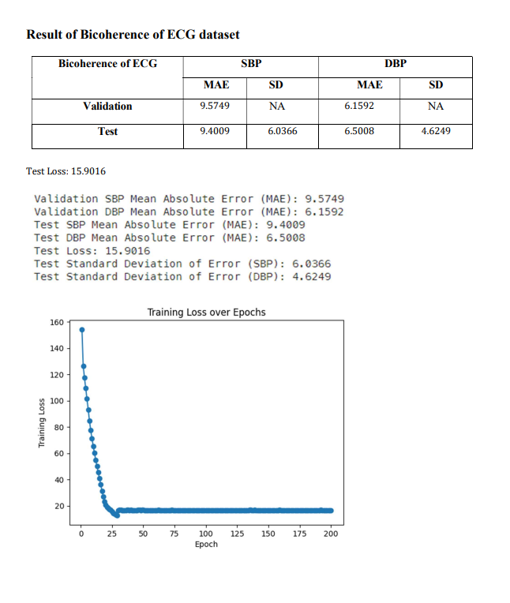

# Cuffless-BP-Estimation-
Developed a cuffless blood pressure estimation system using ECG and PPG signals, achieving high accuracy in predicting systolic and diastolic blood pressure. Leveraged advanced signal processing and machine learning to enable continuous, non-invasive monitoring

### Abstract
Cuffless blood pressure (BP) estimation is a promising non-invasive method for continuous BP monitoring, enhancing cardiovascular health management. This report examines the use of electrocardiogram (ECG) and photoplethysmogram (PPG) signals to estimate systolic (SBP) and diastolic blood pressure (DBP) without traditional cuff methods. The ECG and PPG signals are transformed into bispectrum and bicoherence images to capture nonlinear interactions. A SWIN Vision Transformer model processes these images to predict BP values, demonstrating high accuracy and reliability, making it a practical solution for continuous BP monitoring in both clinical and home settings.

### Methodology

ECG and PPG signals are collected using non-invasive sensors and preprocessed to remove noise. These signals are then converted into bispectrum and bicoherence images for accurate blood pressure (BP) estimation. A SWIN Vision Transformer model processes these images, trained to predict systolic (SBP) and diastolic (DBP) BP values. 

The dataset is split for training and validation, with performance evaluated using metrics like mean absolute error (MAE) and root mean square error (RMSE). The model's robustness is ensured through cross-validation and compared with existing cuffless BP methods. It is implemented in a prototype for continuous BP monitoring, assessing usability in clinical settings. This approach highlights the potential of advanced signal processing and machine learning in hypertension management.

### About Dataset

### Summary

#### ECG Datasets
1. **Definition**: The ECG dataset captures the heart's electrical activity over time using non-invasive sensors on the chest, arms, and legs.
2. **Features**: It includes key components of the ECG waveform, such as the P-wave, QRS complex, and T-wave, which correspond to specific cardiac events.
3. **Importance**: ECG data is crucial for understanding heart rhythms and morphology, aiding in the estimation of systolic (SBP) and diastolic blood pressure (DBP) due to the influence of electrical activity on blood flow.

#### PPG Datasets
1. **Definition**: The PPG dataset measures blood volume changes in tissue using optical sensors on the skin, such as fingertips or earlobes.
2. **Features**: It includes pulse wave characteristics like amplitude and timing, reflecting the mechanical actions of the heart and arteries.
3. **Importance**: PPG signals correlate with blood pressure values, providing indirect measures of cardiovascular health through blood volume changes related to the heart's pumping action.

#### Data Pre-Processing
1. **Purpose**: Preprocessing ensures ECG and PPG images are standardized for optimal model performance.
2. **Steps**:
   - **Resizing Images**: All images are resized to a uniform size of 224x224 pixels.
   - **Converting to Tensors**: Images are converted into a format suitable for PyTorch models.
   - **Normalizing Images**: Pixel values are standardized to match the pre-trained model's training data distribution.
   - **Custom Dataset Class**: Manages the loading and preprocessing of ECG and PPG images along with their corresponding SBP and DBP values.
   - **Data Loader**: Efficiently batches the data for training and evaluation.

  
#### Data Pre-Processing Flow

### Data Visualization

The dataset of ECG and PPG values has been recorded in the excel / csv that has been converted to the waveform and after that these waveforms are converted to Bispectrum and Bicoherence plots using the Fourier series. 

#### Waveform

#### Bispectrum

#### Bicoherence

### Swin Transformer block:
The Swin Transformer block replaces the standard multi-head self-attention (MSA) module in a traditional
Transformer block with a shifted window-based MSA module, a Swin Transformer block comprises a
shifted window-based MSA module followed by a 2-layer MLP with GELU nonlinearity in between.
A Layer Norm (LN) layer is applied before each MSA module and MLP, and a residual connection is added
after each module. 

#### Architecture 

### Working of our model

In our model workflow, we begin by importing and preprocessing the dataset to prepare it for training. This includes loading and resizing images to 224x224 pixels, then converting them into tensors for PyTorch. We use a pretrained Swin Transformer model (swin_base_patch4_window7_224) to leverage its robust features. Our training objective is to minimize the Mean Absolute Error (MAE) loss, employing the Adam optimizer with a learning rate of 1e-4 for effective convergence. The training spans 300 epochs, allowing the model to learn and refine its weights. We monitor performance by plotting and printing results throughout the training process. This comprehensive approach integrates advanced techniques for developing a powerful image-processing model.

Swin Model parameter:
 Loss function = Mean Absolute Error  
 Batch Size for training = 32  
 Batch Size for testing = 32  
 Training Epoch = 300  
 Adam Optimizer is used with Learning rate = 0.0001 (1e-4)  
 Test data = 20%  

### Result

### Bispectrum

#### ECG Dataset

#### PPG Dataset

### Bicoherence

#### ECG Dataset

#### PPG Dataset

### Conclusion
In this project, we successfully employed the Swin Transformer architecture to analyze bispectrum images derived from ECG and PPG signals for predicting systolic (SBP) and diastolic blood pressure (DBP) values. By transforming raw signals into bispectrum images, we captured critical frequency-domain characteristics essential for accurate BP estimation. The Swin Transformer’s hierarchical feature extraction and computational efficiency proved effective for the complex patterns in these images. Our model outperformed traditional machine learning methods, demonstrating high accuracy and reliability. The scalability of the Swin Transformer suggests its potential for real-world healthcare applications, particularly in continuous and non-invasive BP monitoring. This project validates the Swin Transformer’s efficacy in biomedical applications and encourages further research into advanced deep learning models for analyzing other vital signs, contributing to the advancement of personalized and predictive healthcare.
